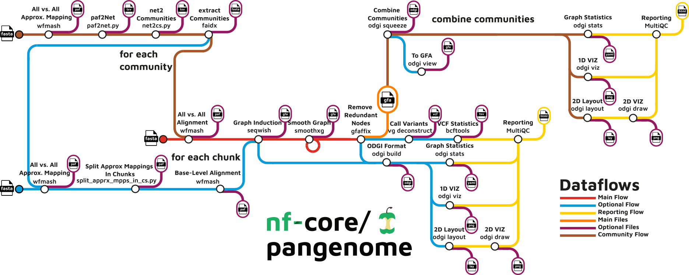

<h1>
  <picture>
    <source media="(prefers-color-scheme: dark)" srcset="docs/images/nf-core-pangenome_logo_dark.png">
    
  </picture>
</h1>

[](https://github.com/nf-core/pangenome/actions/workflows/ci.yml)
[](https://github.com/nf-core/pangenome/actions/workflows/linting.yml)[](https://nf-co.re/pangenome/results)[](https://doi.org/10.5281/zenodo.8202636)

[](https://www.nextflow.io/)
[](https://docs.conda.io/en/latest/)
[](https://www.docker.com/)
[](https://sylabs.io/docs/)
[](https://tower.nf/launch?pipeline=https://github.com/nf-core/pangenome)

[](https://nfcore.slack.com/channels/pangenome)[](https://twitter.com/nf_core)[](https://mstdn.science/@nf_core)[](https://www.youtube.com/c/nf-core)

## Introduction

**nf-core/pangenome** is a bioinformatics best-practice analysis pipeline for pangenome graph construction. The pipeline renders a collection of sequences into a pangenome graph. Its goal is to build a graph that is locally directed and acyclic while preserving large-scale variation. Maintaining local linearity is important for interpretation, visualization, mapping, comparative genomics, and reuse of pangenome graphs.

The pipeline is built using [Nextflow](https://www.nextflow.io), a workflow tool to run tasks across multiple compute infrastructures in a very portable manner. It uses Docker/Singularity containers making installation trivial and results highly reproducible. The [Nextflow DSL2](https://www.nextflow.io/docs/latest/dsl2.html) implementation of this pipeline uses one container per process which makes it much easier to maintain and update software dependencies. Where possible, these processes have been submitted to and installed from [nf-core/modules](https://github.com/nf-core/modules) in order to make them available to all nf-core pipelines, and to everyone within the Nextflow community!

<!-- TODO nf-core: Add full-sized test dataset and amend the paragraph below if applicable -->

On release, automated continuous integration tests run the pipeline on a full-sized dataset on the AWS cloud infrastructure. This ensures that the pipeline runs on AWS, has sensible resource allocation defaults set to run on real-world datasets, and permits the persistent storage of results to benchmark between pipeline releases and other analysis sources. The results obtained from the full-sized test can be viewed on the [nf-core website](https://nf-co.re/pangenome/results).

<p align="center">
    
</p>

## Pipeline summary

- All versus all alignment (`WFMASH`)
- Graph induction (`SEQWISH`)
- Graph normalization (`SMOOTHXG`)
- Remove redundancy (`GFAFFIX`)
- Graph statistics and qualitative visualizations (`ODGI`)
- Combine diagnostic information into a report (`MULTIQC`)

## Usage

> [!NOTE]
> If you are new to Nextflow and nf-core, please refer to [this page](https://nf-co.re/docs/usage/installation) on how to set-up Nextflow. Make sure to [test your setup](https://nf-co.re/docs/usage/introduction#how-to-run-a-pipeline) with `-profile test` before running the workflow on actual data.

Now, you can run the pipeline using:

```bash
nextflow run nf-core/pangenome -r dev --input <BGZIPPED_FASTA> --n_haplotypes <NUM_HAPS_IN_FASTA> --outdir <OUTDIR> -profile <docker/singularity/podman/shifter/charliecloud/conda/institute>
```

> [!WARNING]
> Please provide pipeline parameters via the CLI or Nextflow `-params-file` option. Custom config files including those provided by the `-c` Nextflow option can be used to provide any configuration _**except for parameters**_;
> see [docs](https://nf-co.re/usage/configuration#custom-configuration-files).

For more details and further functionality, please refer to the [usage documentation](https://nf-co.re/pangenome/usage) and the [parameter documentation](https://nf-co.re/pangenome/parameters).

## Advantages over [`PGGB`](https://github.com/pangenome/pggb)

This Nextflow pipeline version's major advantage is that it can distribute the usually computationally heavy all versus all alignment step across a whole cluster. It is capable of splitting the initial approximate alignments into problems of equal size. The base-level alignments are then distributed across several processes. Assuming you have a cluster with 10 nodes and you are the only one using it, we would recommend to set `--wfmash_chunks 10`.
If you have a cluster with 20 nodes, but you have to share it with others, maybe setting it to `--wfmash_chunks 10` could be a good fit, because then you don't have to wait too long for your jobs to finish.

## Pipeline output

To see the results of an example test run with a full size dataset refer to the [results](https://nf-co.re/pangenome/results) tab on the nf-core website pipeline page.
For more details about the output files and reports, please refer to the
[output documentation](https://nf-co.re/pangenome/output).

## Credits

nf-core/pangenome was originally adapted from [PGGB](https://github.com/pangenome/pggb) by [Simon Heumos](https://github.com/subwaystation), [Michael Heuer](https://github.com/heuermh).

> [Simon Heumos](https://github.com/subwaystation) is currently the sole developer.

Many thanks to all who have helped out and contributed along the way, including (but not limited to)\*:

| Name                                                       | Affiliation                                                                                                                                                                                                                                                                                                                                                                       |
| ---------------------------------------------------------- | --------------------------------------------------------------------------------------------------------------------------------------------------------------------------------------------------------------------------------------------------------------------------------------------------------------------------------------------------------------------------------- |
| [Philipp Ehmele](https://github.com/imipenem)              | [Institute of Computational Biology, Helmholtz Zentrum München, Munich, Germany](https://www.helmholtz-muenchen.de/icb/index.html)                                                                                                                                                                                                                                                |
| [Gisela Gabernet](https://github.com/ggabernet)            | [Quantitative Biology Center (QBiC) Tübingen, University of Tübingen, Germany](https://uni-tuebingen.de/en/research/research-infrastructure/quantitative-biology-center-qbic/) <br> [Department of Pathology, Yale School of Medicine, New Haven, USA](https://medicine.yale.edu/pathology/)                                                                                      |
| [Erik Garrison](https://github.com/ekg)                    | [The University of Tennessee Health Science Center, Memphis, Tennessee, TN, USA](https://uthsc.edu/)                                                                                                                                                                                                                                                                              |
| [Andrea Guarracino](https://github.com/AndreaGuarracino)   | [Genomics Research Centre, Human Technopole, Milan, Italy](https://humantechnopole.it/en/) <br> [The University of Tennessee Health Science Center, Memphis, Tennessee, TN, USA](https://uthsc.edu/)                                                                                                                                                                              |
| [Friederike Hanssen](https://github.com/FriederikeHanssen) | [Quantitative Biology Center (QBiC) Tübingen, University of Tübingen, Germany](https://uni-tuebingen.de/en/research/research-infrastructure/quantitative-biology-center-qbic/) <br> [Biomedical Data Science, Department of Computer Science, University of Tübingen, Germany](https://uni-tuebingen.de/en/faculties/faculty-of-science/departments/computer-science/department/) |
| [Peter Heringer](https://github.com/heringerp)             | [Quantitative Biology Center (QBiC) Tübingen, University of Tübingen, Germany](https://uni-tuebingen.de/en/research/research-infrastructure/quantitative-biology-center-qbic/) <br> [Biomedical Data Science, Department of Computer Science, University of Tübingen, Germany](https://uni-tuebingen.de/en/faculties/faculty-of-science/departments/computer-science/department/) |
| [Michael Heuer](https://github.com/heuermh)                | [Mammoth Biosciences, Inc., San Francisco, CA, USA](https://mammoth.bio)                                                                                                                                                                                                                                                                                                          |
| [Lukas Heumos](https://github.com/zethson)                 | [Institute of Computational Biology, Helmholtz Zentrum München, Munich, Germany](https://www.helmholtz-muenchen.de/icb/index.html) <br> [Institute of Lung Biology and Disease and Comprehensive Pneumology Center, Helmholtz Zentrum München, Munich, Germany](https://www.helmholtz-muenchen.de/ilbd/the-institute/cpc/index.html)                                              |
| [Simon Heumos](https://github.com/subwaystation)           | [Quantitative Biology Center (QBiC) Tübingen, University of Tübingen, Germany](https://uni-tuebingen.de/en/research/research-infrastructure/quantitative-biology-center-qbic/) <br> [Biomedical Data Science, Department of Computer Science, University of Tübingen, Germany](https://uni-tuebingen.de/en/faculties/faculty-of-science/departments/computer-science/department/) |
| [Susanne Jodoin](https://github.com/SusiJo)                | [Quantitative Biology Center (QBiC) Tübingen, University of Tübingen, Germany](https://uni-tuebingen.de/en/research/research-infrastructure/quantitative-biology-center-qbic/)                                                                                                                                                                                                    |
| [Júlia Mir Petrol](https://github.com/mirpedrol)           | [Quantitative Biology Center (QBiC) Tübingen, University of Tübingen, Germany](https://uni-tuebingen.de/en/research/research-infrastructure/quantitative-biology-center-qbic/)                                                                                                                                                                                                    |

> \* Listed in alphabetical order

## Acknowledgments

- [QBiC](https://www.qbic.uni-tuebingen.de)
- [deNBI](https://www.denbi.de/)
- [Human Pangenome Reference Consortium](https://humanpangenome.org)

## Contributions and Support

If you would like to contribute to this pipeline, please see the [contributing guidelines](.github/CONTRIBUTING.md).

For further information or help, don't hesitate to get in touch on the [Slack `#pangenome` channel](https://nfcore.slack.com/channels/pangenome) (you can join with [this invite](https://nf-co.re/join/slack)), or contact me [Simon Heumos](mailto:simon.heumos@qbic.uni-tuebingen.de?subject=[GitHub]%20nf-core/pangenome).

## Citations

<!-- If you use nf-core/pangenome for your analysis, please cite it using the following doi: [10.5281/zenodo.XXXXXX](https://doi.org/10.5281/zenodo.XXXXXX) -->

If you use nf-core/pangenome for your analysis, please cite it using the following doi: [10.5281/zenodo.8202636](https://doi.org/10.5281/zenodo.8202636)

An extensive list of references for the tools used by the pipeline can be found in the [`CITATIONS.md`](CITATIONS.md) file.

You can cite the `nf-core` publication as follows:

> **The nf-core framework for community-curated bioinformatics pipelines.**
>
> Philip Ewels, Alexander Peltzer, Sven Fillinger, Harshil Patel, Johannes Alneberg, Andreas Wilm, Maxime Ulysse Garcia, Paolo Di Tommaso & Sven Nahnsen.
>
> _Nat Biotechnol._ 2020 Feb 13. doi: [10.1038/s41587-020-0439-x](https://dx.doi.org/10.1038/s41587-020-0439-x).

## Changelog

[CHANGELOG](CHANGELOG.md)
